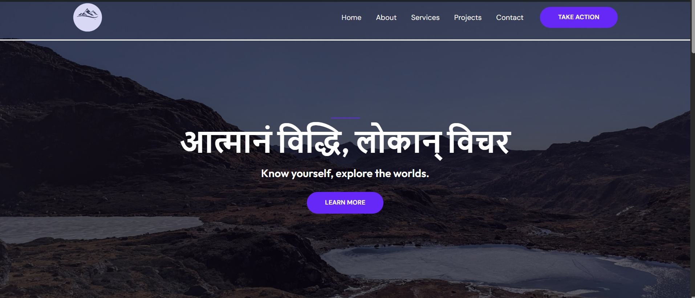

# PravasaDiary

*A Sanskrit-inspired travel blog built with **WordPress**, blending meaningful journeys, culture, and storytelling.*




---

## ✨ Overview

**PravasaDiary** documents travel stories—spiritual yatras, hidden gems, and cultural notes—in a clean, fast WordPress site.
This repo focuses on custom code (theme/plugin) and configuration; WordPress core is re-downloaded during setup.

---

## 📂 Structure

```
project-root/
├─ wp-content/
│  ├─ themes/
│  │  └─ pravasa-diary/          # custom theme (tracked)
│  ├─ plugins/
│  │  └─ pravasa-diary-custom/   # optional custom plugin(s)
│  └─ uploads/                   # media (ignored by default)
├─ .gitignore
└─ README.md
```

---

## 🛠️ Tech Stack

* **WordPress**, **PHP**, **MySQL**
* **HTML**, **CSS**, **JavaScript**
* **Git/GitHub**

---

## 🚀 Local Setup (Quick)

1. **Clone**

   ```bash
   git clone <your-repo-url> pravasa-diary
   cd pravasa-diary
   ```
2. **Download WordPress core**

   * With WP-CLI:

     ```bash
     wp core download
     ```
   * Or download ZIP from wordpress.org and extract to project root.
3. **Create database & config**

   ```bash
   mysql -u root -p -e "CREATE DATABASE IF NOT EXISTS pravasa DEFAULT CHARACTER SET utf8mb4 COLLATE utf8mb4_unicode_ci;"
   wp config create --dbname=pravasa --dbuser=root --dbpass=<password> --dbhost=127.0.0.1 --skip-check
   ```
4. **Install WordPress**

   ```bash
   wp core install \
     --url="http://localhost/pravasa" \
     --title="PravasaDiary" \
     --admin_user=admin \
     --admin_password=adminpass \
     --admin_email=you@example.com
   ```
5. **Activate theme/plugin**

   ```bash
   wp theme activate pravasa-diary
   # wp plugin activate pravasa-diary-custom
   ```

---

## 🗃️ .gitignore (Recommended)

```gitignore
# WordPress core
wp-admin/
wp-includes/

# Content (choose what to track)
wp-content/uploads/
wp-content/cache/
wp-content/backups/
wp-content/upgrade/
wp-content/ai1wm-backups/

# Deps
vendor/
node_modules/

# Secrets & env
wp-config.php
.env

# OS/IDE
.DS_Store
Thumbs.db
.vscode/
.idea/
*.log
```

Apply ignores to already-tracked files:

```bash
git rm -r --cached .
git add .
git commit -m "Apply .gitignore and clean index"
```

---

## 🔁 Re-download / Restore

* **WordPress core:** `wp core download --force`
* **Themes/Plugins (WP repo):** `wp theme install <slug> --activate` / `wp plugin install <slug> --activate`
* **Media:** restore `wp-content/uploads/` from backup

---

## 🧪 Useful WP-CLI

```bash
# After domain change
wp search-replace 'http://old.local' 'http://localhost/pravasa'

# DB export/import
wp db export backup.sql
# wp db import backup.sql
```

---


## 📩 Contact

Questions or suggestions? Open an issue or reach out via your preferred contact listed in the repo.
